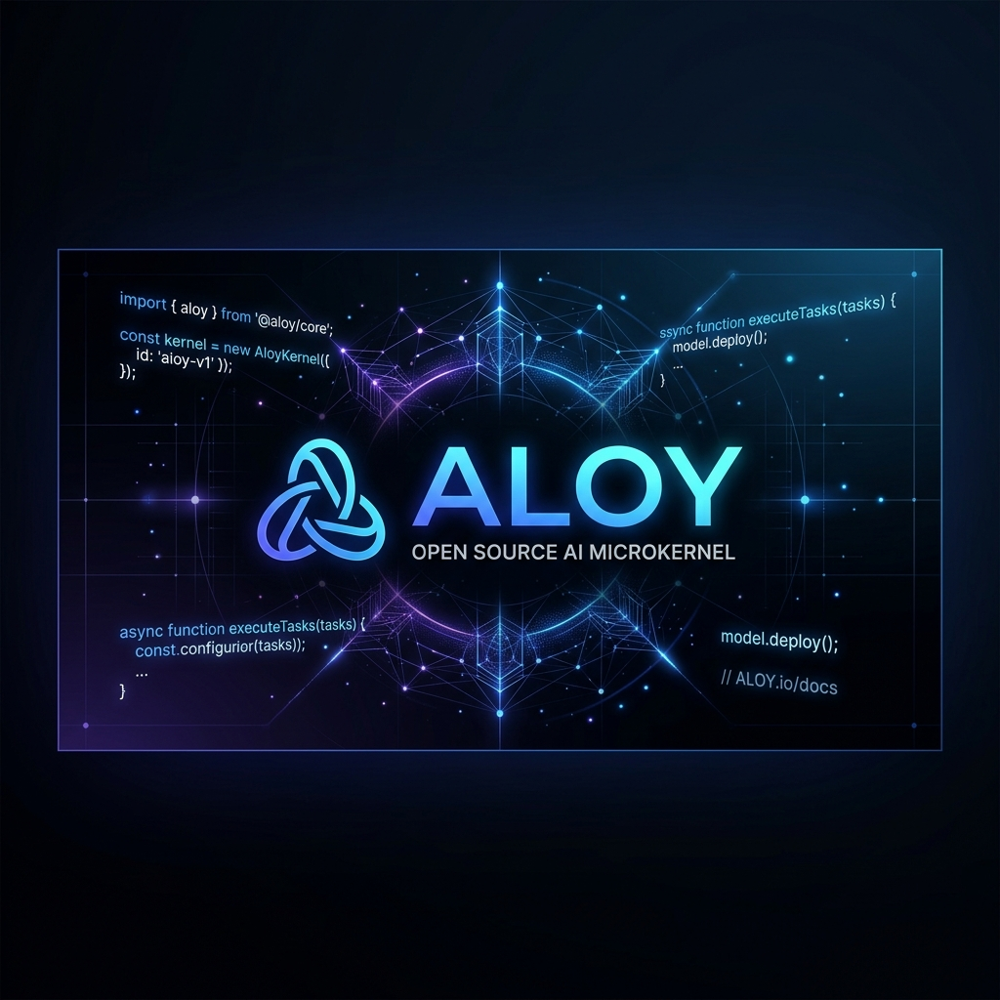
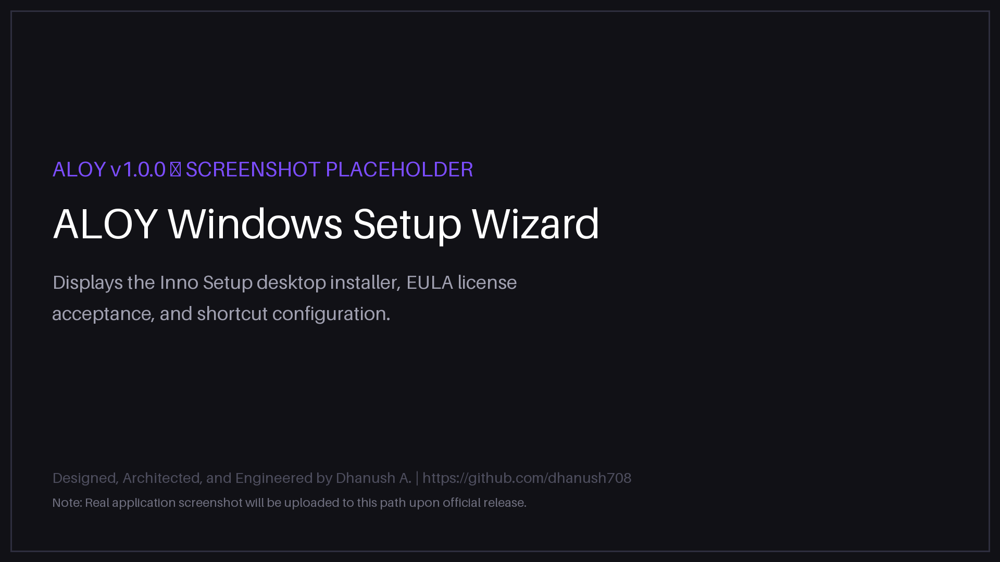

<div align="center">



# ALOY

### Advanced Local-First Agentic Operating System

*Your AI companion that runs entirely on your local machine.*

[](https://github.com/dhanush708/aloy/releases)
[](https://github.com/dhanush708/aloy/releases)
[](LICENSE)
[](https://ollama.com)
[](https://python.org)
[](https://github.com/dhanush708/aloy)

</div>

<br/>

> **ALOY is a fully offline, privacy-first AI operating system.** It runs entirely on your local hardware — no cloud dependencies, no subscription fees, no external API keys. It thinks, plans, codes, tests, and learns locally using open-source models through [Ollama](https://ollama.com).

---

## Table of Contents

1. [What is ALOY?](#-what-is-aloy)
2. [Key Features](#-key-features)
3. [Architecture Overview](#️-architecture-overview)
4. [Technology Stack](#️-technology-stack)
5. [System Requirements](#-system-requirements)
6. [Download & Install](#️-download--install)
7. [First Run Guide](#-first-run-guide)
8. [Screenshots](#-screenshots)
9. [Documentation](#-documentation)
10. [Known Limitations](#️-known-limitations)
11. [Roadmap](#️-roadmap)
12. [Contributing](#-contributing)
13. [Bug Reporting & Support](#-bug-reporting--support)
14. [License](#-license)

---

## What is ALOY?

**ALOY** is a local-first AI operating system — a personal companion, software engineering partner, and autonomous multi-agent runtime that operates entirely on your own hardware.

ALOY coordinates specialized subsystems locally:
- An **asynchronous microkernel event bus** that decouples all system services.
- **Multi-tier hybrid memory** combining semantic vector search (sqlite-vec) and exact full-text indexing (FTS5) with Reciprocal Rank Fusion scoring.
- A **sandboxed tool execution engine** with user-gated authorization for file, terminal, git, and Docker actions.
- An **autonomous multi-agent FSM grid** (9 specialized agents) that decomposes goals, writes, tests, debugs, and documents code locally.

**ALOY does not send your data anywhere.** Every inference request runs through your local Ollama server. All conversation history and memory is stored in an isolated SQLite database on your device.

---

## Key Features

| Feature | Description |
| :--- | :--- |
| **Local-First AI** | All inference runs through Ollama on your hardware. No cloud. No API keys. |
| **Long-Term Memory** | Hybrid vector + FTS5 memory with decay scoring, contradiction detection, and semantic clustering. Persists across sessions. |
| **Multi-Agent System** | 9 cooperating agents (Manager, Planner, Architect, Coder, Tester, Debugger, Reviewer, Documenter, Learner) executing on a parallel FSM grid. |
| **Internet Search** | Concurrent web search with temporal relevance scoring, official source weighting, query broadening retries, and topic drift classification. |
| **Knowledge Retrieval** | 6-layer escalation router: Episodic Memory → Local Files → Documentation → Web Search. |
| **Model Routing** | Task-to-model routing table (15 task types, 5 models) with conversation continuity and automatic fallback. |
| **Conversation History** | Full conversation CRUD with branching, regeneration, feedback, and real-time SSE streaming. |
| **Privacy-First Architecture** | Zero telemetry. Zero external data. In-stream sanitizers prevent system prompt leakage. All data stored locally in SQLite (WAL mode). |
| **Reasoning Engine** | Multi-stage think/refine/verify pipeline with live reasoning trace display. Thinking tokens stripped from final responses. |
| **Tool Sandbox** | Absolute workspace boundary enforcement for file, terminal, git, Docker, browser, and Python tools. |

---

## Architecture Overview

ALOY uses a microkernel core that runs a central async event bus to coordinate all services:

```
User Message
     |
     v
 Event Bus (Async Microkernel)
     |
     |---> Identity Engine      (creator + user profile resolution)
     |---> Memory Manager       (hybrid vector + FTS5 retrieval)
     |---> Knowledge Router     (6-layer query routing + web search)
     |---> Model Router         (task-to-model assignment, 15 task types)
     |
     v
 Local Ollama Model (phi4-mini / qwen3:14b / qwen2.5-coder / deepseek-r1)
     |
     v
 Prompt Integrity Filter       (stream sanitization, think-block stripping)
     |
     v
 SSE Streaming Response        (Markdown rendered in browser SPA)
```

**Agent Grid FSM:**
```
IDLE -> PLANNING -> EXECUTING -> TESTING -> DEBUGGING -> COMPLETED
                       |                        |
                       +---- ROLLED_BACK <------+
                             (auto re-plan from last Git checkpoint)
```

> For the full architecture document, see [docs/architecture.md](docs/architecture.md) or the [Technical Whitepaper](docs/aloy_technical_whitepaper.pdf).

---

## Technology Stack

| Layer | Technology |
| :--- | :--- |
| **Backend** | Python 3.11, FastAPI, Uvicorn (ASGI) |
| **LLM Runtime** | Ollama (local inference engine) |
| **Database** | SQLite 3 in WAL mode, sqlite-vec (vector extension), FTS5 |
| **Memory** | sqlite-vec cosine similarity, FTS5, Reciprocal Rank Fusion |
| **Frontend** | Single-Page Application (Vanilla JS, CSS, HTML) — browser-based UI |
| **Streaming** | Server-Sent Events (SSE) via sse-starlette |
| **Tool Runtime** | Sandboxed subprocess executor with confirmation workflow |
| **Tokenization** | tiktoken (offline cache bundled in installer) |
| **Packaging** | PyInstaller + Inno Setup — single .exe installer |
| **Agent Scheduling** | Async FSM grid with parallel task execution and SQLite task queue |

---

## System Requirements

| Requirement | Minimum | Recommended |
| :--- | :--- | :--- |
| **Operating System** | Windows 10 (64-bit) | Windows 11 (64-bit) |
| **RAM** | 16 GB | 32 GB or more |
| **GPU** | Dedicated GPU (6+ GB VRAM) | NVIDIA GPU with 8+ GB VRAM |
| **Storage** | 5 GB free | 25 GB free (for local model storage) |
| **Ollama** | Required — latest version | Running in background |

---

## Download & Install

### Step 1 — Download Ollama
Download and install Ollama from [ollama.com](https://ollama.com). Ensure it is running in the background before launching ALOY.

### Step 2 — Download ALOY
Go to the **[Releases](https://github.com/dhanush708/aloy/releases)** page and download:
```
ALOY-Setup-1.0.0.exe
```

### Step 3 — Run the Installer
Double-click `ALOY-Setup-1.0.0.exe`. The installer places ALOY in `Program Files\ALOY`, creates Desktop and Start Menu shortcuts, and configures a localhost firewall rule for port 8000.

### Step 4 — Launch ALOY
Click the **ALOY** desktop shortcut. Your default browser opens automatically to the ALOY dashboard. On first launch, the startup diagnostic wizard verifies model installations.

> For detailed setup instructions, see [docs/installation.md](docs/installation.md).

---

## First Run Guide

1. **Verify Ollama is active** in your system taskbar.
2. **Pull the required local models** (ALOY displays missing models on the startup checklist):
   ```bash
   ollama pull qwen3:14b
   ollama pull qwen2.5-coder:14b
   ollama pull deepseek-r1:14b
   ollama pull nomic-embed-text:latest
   ```
3. **Launch ALOY** — click the desktop shortcut and complete the onboarding wizard. Enter your name and custom instructions. All preferences are saved locally.

> The embedding model (`nomic-embed-text`) and reasoning model (`deepseek-r1:14b`) are optional. ALOY falls back gracefully — using FTS5 keyword search and standard generation respectively — if they are not installed.

---

## Screenshots

<div align="center">
  <table>
    <tr>
      <td><b>01. Workspace Home</b><br/></td>
      <td><b>02. Chat Client</b><br/></td>
    </tr>
    <tr>
      <td><b>03. Agent Execution Grid</b><br/></td>
      <td><b>04. Long-Term Memory Explorer</b><br/></td>
    </tr>
    <tr>
      <td><b>05. Settings & Model Configuration</b><br/></td>
      <td><b>06. Concurrent Web Search</b><br/></td>
    </tr>
    <tr>
      <td colspan="2" align="center"><b>07. Installation Wizard</b><br/></td>
    </tr>
  </table>
</div>

The interface features a premium glassmorphism aesthetic with:
- **Live System Telemetry**: Real-time CPU, RAM, and GPU VRAM gauges.
- **Reasoning Trace Drawer**: Displays the live thinking trace (Draft → Refine → Verify) of reasoning models.
- **Execution Grid Panel**: Real-time agent task progress, parallel step queues, and confirmation logs.
- **Theme Controls**: Light, Dark, and OLED high-contrast themes.

---

## Documentation

| Document | Description |
| :--- | :--- |
| [Technical Whitepaper](docs/aloy_technical_whitepaper.pdf) | Comprehensive system design, AI safety analysis, and threat model specification. |
| [System Architecture](docs/architecture.md) | Event-driven microkernel blocks, FSM diagrams, and subsystem service map. |
| [Installation Guide](docs/installation.md) | Manual setup, model configurations, and setup parameters. |
| [FAQ & Troubleshooting](docs/faq.md) | GPU acceleration advice, VRAM management, startup diagnostics. |
| [Known Limitations](docs/known-limitations.md) | VRAM constraints, OS targets, and single-workspace limits. |
| [Roadmap](docs/roadmap.md) | Future feature iterations and release targets. |
| [Release Notes v1.0](docs/release-notes.md) | What's new in version 1.0.0. |

---

## Known Limitations

- **Windows Only (v1.0):** macOS and Linux packaging are not yet available.
- **Single Active Workspace:** The agent workspace lock prevents concurrent multi-project execution in a single instance.
- **Ollama Required:** ALOY cannot generate responses without a running local Ollama installation.
- **VRAM-Dependent Performance:** Models run significantly faster with a dedicated NVIDIA GPU. CPU-only inference is supported but slow for large models.
- **Context Window Limits:** Very long conversations are truncated to fit model context windows (32K tokens for most configured models).

> See [docs/known-limitations.md](docs/known-limitations.md) for a complete breakdown.

---

## Roadmap

- **v1.1 (Q3 2026)**: Dynamic tool plugins, reduced installer size, CSV/JSON memory exports.
- **v1.2 (Q4 2026)**: Collaborative workspaces and cross-session agent sync.
- **v1.5 (Q2 2027)**: Self-evolution microkernel — autonomous backend prompt compilation and model fallback optimization.

> See [docs/roadmap.md](docs/roadmap.md) for detailed milestone descriptions.

---

## Contributing

ALOY's core source code is proprietary. Community contributions are welcome in these areas:

- **Bug Reports**: Use [GitHub Issues](https://github.com/dhanush708/aloy/issues) with reproduction steps and environment details.
- **Feature Requests**: Open a GitHub Discussion describing the use case and expected behavior.
- **Documentation Improvements**: Pull requests improving the public documentation are welcome.

Please read [CONTRIBUTING.md](CONTRIBUTING.md) and [CODE_OF_CONDUCT.md](CODE_OF_CONDUCT.md) before submitting.

---

## Bug Reporting & Support

1. **Submit an issue** on [GitHub Issues](https://github.com/dhanush708/aloy/issues) with a description, steps to reproduce, and your system details.
2. **Check the startup log** at `%APPDATA%\ALOY\logs\startup.log` for error details before reporting.
3. **For commercial inquiries or EULA licensing**, contact [anbudhanush31@gmail.com](mailto:anbudhanush31@gmail.com).

---

## About the Creator

**ALOY** was designed, engineered, implemented, tested, documented, packaged, and released end-to-end by **Dhanush A.** as an independent project.

- **GitHub**: [github.com/dhanush708](https://github.com/dhanush708)
- **Contact**: [anbudhanush31@gmail.com](mailto:anbudhanush31@gmail.com)

---

## License

ALOY is proprietary software distributed under a custom End User License Agreement (EULA). See [LICENSE](LICENSE) for redistribution restrictions, personal non-commercial use terms, and attribution requirements.

---

<div align="center">
  <sub>Built for a world where AI belongs to the people who use it — not the servers that serve it.</sub>
</div>
