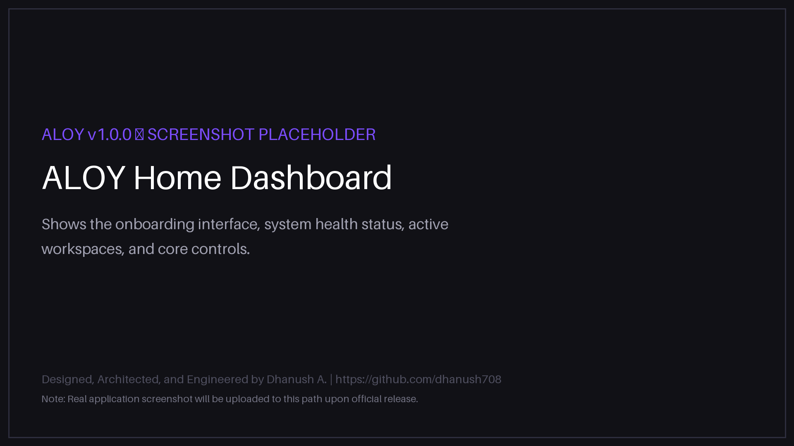
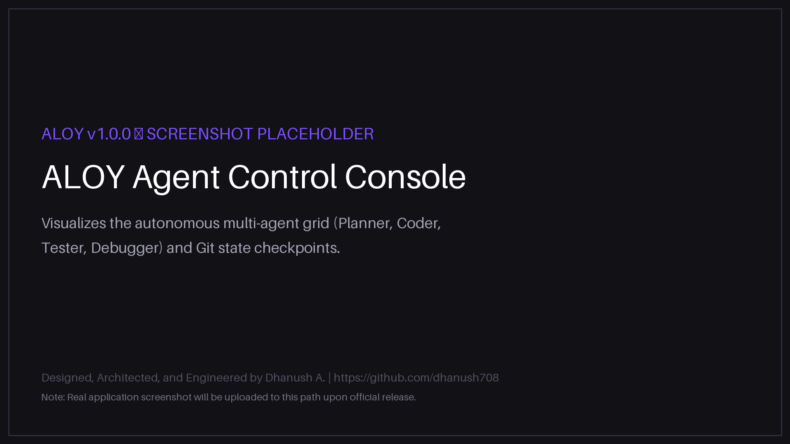
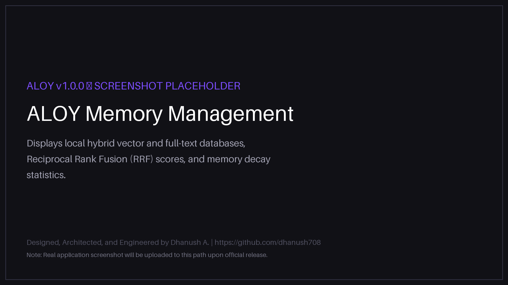
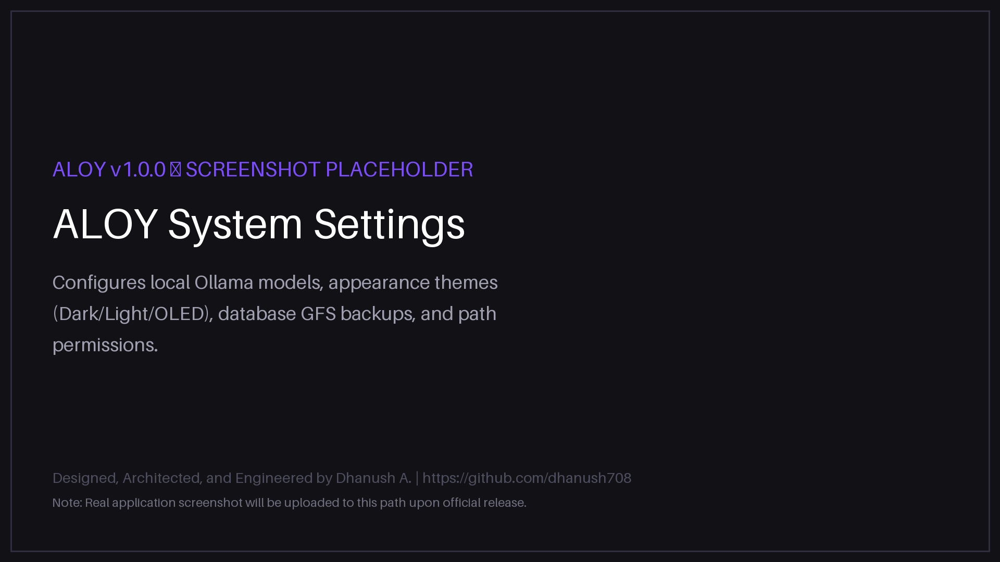
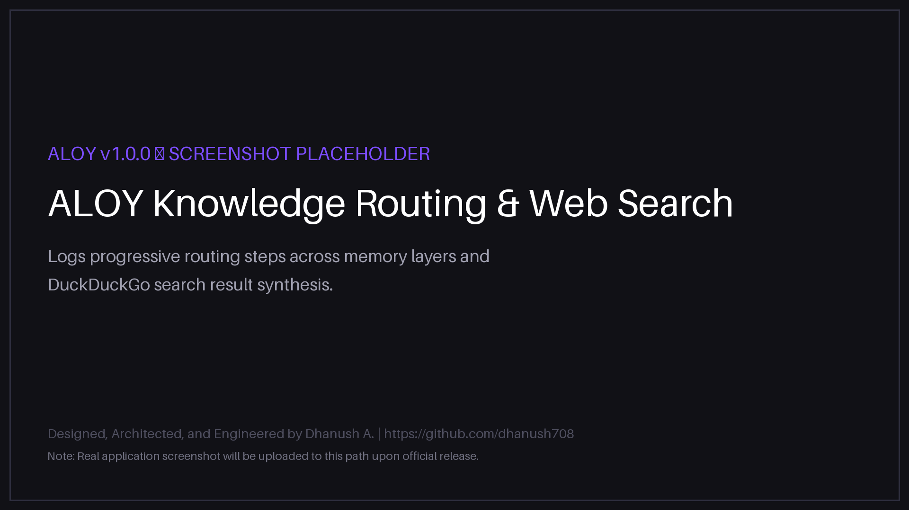

<div align="center">

# ALOY

### Advanced Local-First Agentic Operating System

*Your AI companion that runs entirely on your local machine.*

[](https://github.com/dhanush708/aloy/releases)
[](https://github.com/dhanush708/aloy/releases)
[](LICENSE)
[](https://ollama.com)
[](https://python.org)
[](https://github.com/dhanush708/aloy)

</div>

<br/>

> **ALOY is a fully offline, privacy-first AI operating system.** It runs entirely on your local hardware — no cloud dependencies, no subscription fees, no external API keys. It thinks, plans, codes, tests, and learns locally.

---

## 📖 Table of Contents

1. [What is ALOY?](#-what-is-aloy)
2. [Why ALOY?](#-why-aloy)
3. [Key Features](#-key-features)
4. [Architecture Overview](#-architecture-overview)
5. [System Requirements](#-system-requirements)
6. [Download & Install](#-download--install)
7. [First Run Guide](#-first-run-guide)
8. [Dynamic UI & Telemetry](#-dynamic-ui--telemetry)
9. [Documentation](#-documentation)
10. [Roadmap](#-roadmap)
11. [Known Limitations](#-known-limitations)
12. [FAQ](#-faq)
13. [Bug Reporting & Support](#-bug-reporting--support)
14. [About the Creator](#-about-the-creator)
15. [License](#-license)

---

## 🌟 What is ALOY?

**ALOY** is a local-first AI operating system — a local companion, software engineering partner, and autonomous multi-agent runtime designed to operate entirely on your own hardware. 

ALOY orchestrates specialized subsystems locally:
- An **asynchronous microkernel event bus** decoupling system services.
- **Multi-tier hybrid memory** combining semantic vector search and exact full-text indexing (FTS5).
- A **sandboxed tool execution engine** with explicit, user-gated authorization callbacks.
- An **autonomous multi-agent FSM grid** that decomposes, writes, tests, and debugs code locally.

**ALOY does not send your data to the cloud.** Every inference request runs through your local [Ollama](https://ollama.com) server, and all conversation histories are stored inside an isolated SQLite database on your device.

---

## 🧩 Why ALOY?

| Principle | What It Means For You |
| :--- | :--- |
| **Fully Offline** | Inference, embeddings, databases, and tool actions run completely offline on your hardware. |
| **Zero Data Collection** | Conversations, code context, and personal memory stay strictly local. No telemetry, no analytics, no external servers. |
| **Autonomous Agent Grid** | Rather than generating raw code chunks, ALOY schedules cooperating agents (Planner, Coder, Tester, Debugger) that execute, test, and refactor code until unit tests pass. |
| **Persistent Long-Term Memory** | Retains creator profiles, user preferences, and developer configurations across sessions using hybrid FTS5 + vector search with Reciprocal Rank Fusion (RRF) scoring. |
| **Prompt Integrity & Security** | In-stream sanitizers and lookup buffers prevent system prompt configurations and XML metadata tags from leaking into user chat windows. |
| **Premium Experience** | Polished SPA interface featuring animated thought-streaming consoles, light/dark/OLED themes, and real-time CPU/GPU/VRAM telemetry. |

---

## 🚀 Key Features

- **Conversation Engine**: Real-time SSE streaming with inline cursors, automatic title summarization, and branchable timeline histories.
- **Memory System**: cos-similarity vector search (`sqlite-vec`) merged with FTS5 keyword indexing, memory decay scoring, and background contradiction checks.
- **Reasoning Engine**: Multi-stage thinking (Draft → Refine → Verify) displaying raw logs in the "Reasoning Thoughts" live stats drawer.
- **Knowledge Router**: 6-layer escalation schema (Episodic Memory → Local Files → Docs → Web Search) to supply accurate context.
- **Search Pipeline**: Semantic search classification, concurrent DuckDuckGo queries, temporal relevance scoring (+15 points official doc bonus), query broadening retries, and topic drift classification.
- **Agent Runtime Grid**: Concurrent execution of up to 4 parallel task steps on a dynamic dependency graph with Git checkpointing and surgical rollbacks.
- **Tool Sandbox**: Absolute workspace boundary checks for file, terminal, git, and Docker tools, guarded by mandatory confirmation modals.

---

## 🏗️ Architecture Overview

ALOY relies on a microkernel core running a central event bus to coordinate services:

```
User Message
     │
     ▼
 Event Bus (Async Microkernel)
     │
     ├──► Identity Engine      (creator + user profile resolution)
     ├──► Memory Manager       (hybrid vector + FTS5 retrieval)
     ├──► Knowledge Router     (6-layer query routing + web search)
     ├──► Model Router         (task-to-model assignment)
     │
     ▼
 Local Ollama Model (Qwen3 / Qwen2.5-Coder / DeepSeek R1)
     │
     ▼
 Prompt Integrity Filter       (stream sanitization)
     │
     ▼
 SSE Streaming Response        (Markdown rendered in browser)
```

**Agent Grid FSM Execution:**
```
IDLE → PLANNING → EXECUTING → TESTING → DEBUGGING → COMPLETED
                    │                        │
                    └──── ROLLED_BACK ◄──────┘
                          (auto re-plan from last checkpoint)
```

> For a detailed architecture document, see [docs/architecture.md](docs/architecture.md).

---

## 💻 System Requirements

| Requirement | Minimum | Recommended |
| :--- | :--- | :--- |
| **Operating System** | Windows 10 (64-bit) | Windows 11 (64-bit) |
| **RAM** | 16 GB | 32 GB or more |
| **GPU** | Dedicated GPU (6+ GB VRAM) | NVIDIA GPU with 8+ GB VRAM |
| **Storage** | 5 GB free | 25 GB free (for local model storage) |
| **Ollama** | Required | Latest version active in background |

---

## ⬇️ Download & Install

### Step 1 — Download Ollama
Download and install Ollama from [ollama.com](https://ollama.com). Ensure it is running in the background.

### Step 2 — Download ALOY
Go to the **[Releases](https://github.com/dhanush708/aloy/releases)** page and download the installer:
```
ALOY-Setup-1.0.0.exe
```

### Step 3 — Run the Installer
Double-click `ALOY-Setup-1.0.0.exe`. The installer will place ALOY in `Program Files\ALOY` and create Desktop and Start Menu shortcuts.

### Step 4 — Launch ALOY
Click the **ALOY** desktop shortcut. Your browser will automatically open to the ALOY workspace dashboard. On first launch, the startup wizard will verify model installations.

---

## 🚀 First Run Guide

1. **Verify Ollama is active** in your taskbar.
2. **Pull the required local models** using a terminal (ALOY will display a checklist of these commands if they are missing):
   ```bash
   ollama pull qwen3:14b
   ollama pull qwen2.5-coder:14b
   ollama pull deepseek-r1:14b
   ollama pull nomic-embed-text:latest
   ```
3. **Launch ALOY** and complete the onboarding wizard. Enter your name and custom instructions; all setup preferences are preserved strictly in your local database.

---

## 📊 Dynamic UI & Telemetry

ALOY's single-page web interface is designed with a premium, glassmorphism aesthetic featuring:
- **System Telemetry Panel**: Live hardware gauges tracking CPU usage, system RAM, and GPU VRAM indicators in real-time.
- **Reasoning thoughts Drawer**: Displays the active thinking trace (Draft → Refine → Verify) of the reasoning model as it runs.
- **Execution Grid Panel**: Shows the state of the active agent session, displaying progress bars, parallel task queues, execution retry counts, and live action confirmation logs.
- **Theme Controls**: Switch seamlessly between Light, Dark, and OLED high-contrast developer themes.

### 📸 Screenshot Gallery

<div align="center">
  <table>
    <tr>
      <td><b>01. Workspace Home</b><br/></td>
      <td><b>02. Chat Client</b><br/></td>
    </tr>
    <tr>
      <td><b>03. Agent Execution Grid</b><br/></td>
      <td><b>04. Long-Term Memory Explorer</b><br/></td>
    </tr>
    <tr>
      <td><b>05. Settings & Model Configuration</b><br/></td>
      <td><b>06. Concurrent Web Search</b><br/></td>
    </tr>
  </table>
</div>

---

## 📖 Documentation

Detailed architectural and developer guides are available:
- [Technical Whitepaper](docs/aloy_technical_whitepaper.pdf) — Comprehensive system design and AI safety threat model specification.
- [System Architecture](docs/architecture.md) — Event-driven microkernel blocks and subsystem services.
- [Installation Guide](docs/installation.md) — Comprehensive guide on manual installations, model configurations, and setup parameters.
- [Frequently Asked Questions (FAQ)](docs/faq.md) — Troubleshooting guides, GPU acceleration advice, and VRAM management.
- [Known Limitations](docs/known-limitations.md) — VRAM constraints and OS targets.
- [Roadmap](docs/roadmap.md) — Future feature iterations.

---

## 🗺️ Roadmap

- **v1.1 (Q3 2026)**: Dynamic tool plugins, smaller installer size, and CSV/JSON memory exports.
- **v1.2 (Q4 2026)**: Collaborative workspaces and cross-session agent sync.
- **v1.5 (Q2 2027)**: Self-evolution microkernel — autonomous backend prompt compilation and model fallback optimization.

---

## 🐛 Bug Reporting & Support

1. **Submit an issue** on [GitHub Issues](https://github.com/dhanush708/aloy/issues) with a description, reproduction steps, and your environment setup.
2. **For commercial inquiries or EULA support**, contact the creator at [anbudhanush31@gmail.com](mailto:anbudhanush31@gmail.com).

---

## 👤 About the Creator

**ALOY** was designed, engineered, implemented, tested, documented, packaged, and released end-to-end by **Dhanush A.** as an independent local software project.

- **Creator**: Dhanush A.
- **GitHub**: [github.com/dhanush708](https://github.com/dhanush708)
- **Contact**: [anbudhanush31@gmail.com](mailto:anbudhanush31@gmail.com)

*All event-driven components, FSM grid orchestrators, knowledge routers, and telemetry systems are the intellectual property of the creator.*

---

## 📄 License

ALOY is proprietary software distributed under a custom EULA. Review [LICENSE](LICENSE) for redistribution restrictions, personal non-commercial terms, and attribution guidelines.
